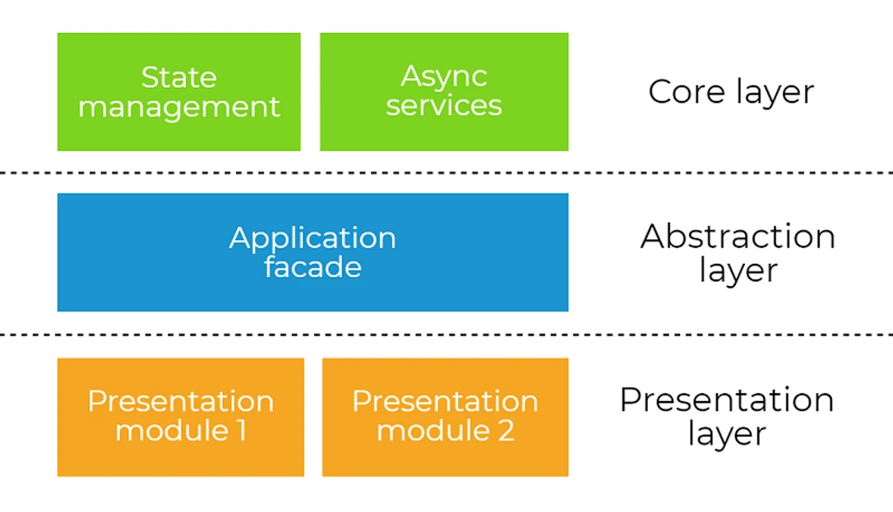
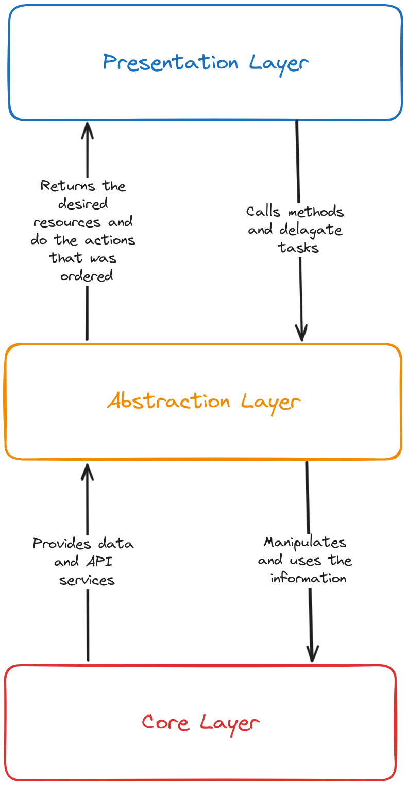

# Architecture Pattern

The base project was created to give a quick "start" to the discipline's team projects. But, at the same time, we didn't want to give up a certain level of organization that helps to develop features safely and makes it easier to create tests. It is highly recommended for you to read the [article by the Dev Academy](https://dev-academy.com/angular-architecture-best-practices/), that explains in details all the important concepts to understand the architecture used in this project.

## Table of Contents

1. [Abstraction Layers](#abstraction-layers)
2. [Separation into modules](#separation-into-modules)
3. [Shared](#shared)
4. [Conclusion](#conclusion)

---

## Abstraction Layers

The idea of this approach is to divide all the modules into layers, creating an abstraction that facilitates the understanding of each module's responsibilities. This architecture ensures that each layer of the system (core, abstraction, or presentation) has its appropriate responsibilities, as depicted in the image below. 

The application flow can be described by the follow diagram:

### Presentation Layer

This is the place where all our Angular components will be created and the only responsibilities of this layer are to present and to delegate. So, involves displaying the user interface and transferring user actions and data management to the core layer. This interaction occurs via the abstraction layer, which facilitates the communication between the presentation layer and the core layer. 
It's important to note that the presentation layer should not concern itself with the implementation details, and components should only invoke methods from the abstraction layer as needed (delegation).

### Abstraction Layer

The abstraction layer is the intermediate layer that connects the UI components of the presentation layer to the application state (data) and the API calls, in the core layer, through a service called "facade". This service means to be a "facade" to the core layer, in order to make the communication more consistent and structured. We can implement facades by simply using Angular class providers. That classes may be named with Facade postfix, for example the ["HomeFacade"](../src/app/home/home.facade.ts). You can find this example of a facade implementation in the "Home" module.

### Core Layer

The last layer is the core layer. Here is where core application logic is implemented. All data manipulation and outside world communication happen here. That is done through two main files, the API and the State.

##### API

The goal of API service is communicate with backend to get the information and data that the application must have access. Generally, the API file is located in a "api" called folder and each module that has to make backend calls needs an API folder. You already have an example of [API](../src/app/home/api/home.api.ts) in the "Home" module, if you want to take a look.

##### State

The module state is a file that has the responsibility of creates all the frontend data representations of data sent by the backend and manipulates these information when it is desired. You can see an [example](../src/app/home/state/home.state.ts) of this file in the "Home" module.

## Separation into modules

The idea here is that each flow or important part of the project is separated into modules. 

### Components

The interface components that can be reused in other parts of the module in question would be created in the "components" folder. For example, a simple component that lists values as you want, like the component ["list-items"](../src/app/home/components/list-items/list-items.component.ts) in the example module "Home" of the base project. So, this list would be located in the "Home" module, inside the "components" folder.

### Pages

The pages would be where the "full screens" would go. For example, a login page would have inputs, buttons, and other components needed for that specific functionality.

### Context

The context is made up of a series of files that we will try to explain in parts. In general, this is where we concentrate our application's business logic, such as functions to make requests to the back-end and module state management, among other aspects.

To manage state, we will be using React's useReducer. Consequently, we will use actions logic to determine what changes should be made to the state.

### types.ts

As the name suggests, this is a type definition file. Here, we define the data types, interfaces and classes for the application, that is, the attributes that the application state must have, and the types of actions, which basically define which actions can be used to manipulate the state.

### Services

The service folder is where we concentrate the various of services files responsible for executing the business logic actions in a module. These services files has functions that are called from pages and components when needed.

## Shared

The "shared" folder is the representation of a module that contains information that can be reused in other modules. For example, it can include a generic button component that can be used in different parts of the application (as was created in this project).

---

## Conclusion

Certainly, there are more details about the functionalities that are used in the project. However, the **Home** module example case already covers many aspects, including testing. The base project is designed to make it easy, not to limit your preferences. What needs to be emphasized is that the main idea is the architecture used, which clearly distributes code responsibilities, thus facilitating maintenance and testing.
